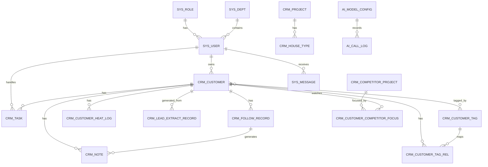
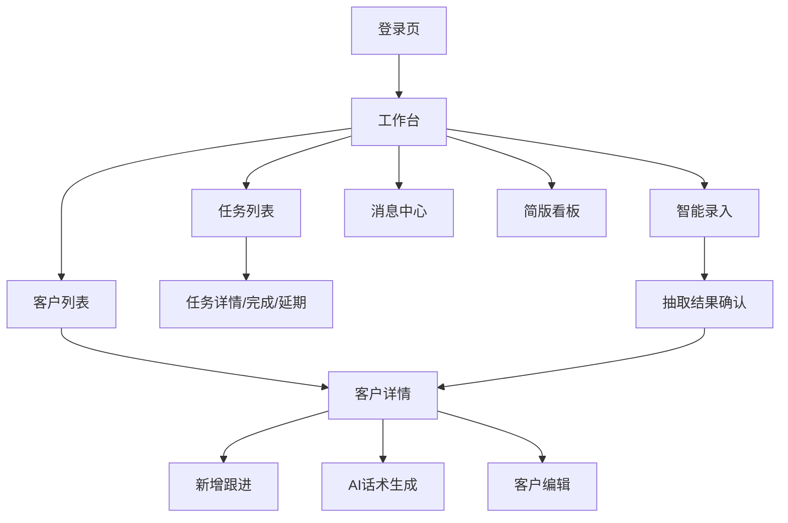
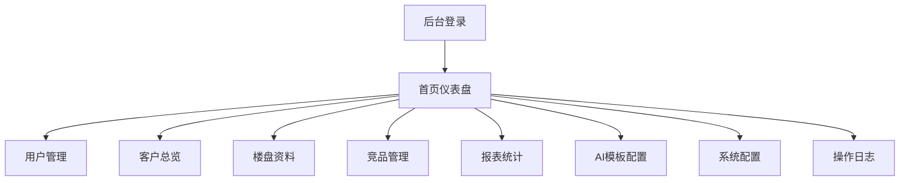
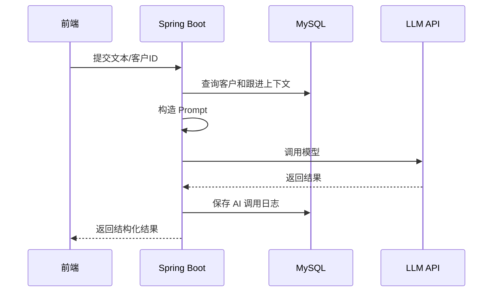

# 基于 Spring Boot 与 LLM 的客户购房意向跟进提醒系统前期准备总览

## 1. 项目定位

本系统面向房产销售跟进场景，目标是把客户线索、跟进记录、提醒任务、AI 话术、热度评分和销售看板整合到统一平台中，帮助置业顾问减少漏跟进，提高客户转化效率，并为销售经理提供团队管理和经营分析能力。

系统采用双前端架构：

- `uni-app 小程序端`：面向置业顾问和销售经理，运行在微信小程序端，负责移动业务操作。
- `Vue3 + Element Plus 管理端`：面向管理员和销售经理，负责后台管理、基础配置和详细报表。
- `Spring Boot 后端`：提供统一接口、权限控制、业务处理、AI 调用、数据统计和定时任务能力。

## 2. 技术栈

| 层级 | 技术 |
|---|---|
| 小程序端 | uni-app、微信小程序、uni-ui 或自定义组件 |
| Web 管理端 | Vue3、Element Plus、Vite、ECharts |
| 后端 | Spring Boot、MyBatis-Plus、Spring Security 或 JWT 拦截器 |
| 数据库 | MySQL 8.0 |
| 缓存 | Redis 6.x |
| AI 能力 | DeepSeek API 或其他 LLM API |
| 开发工具 | IntelliJ IDEA、HBuilderX 或 VS Code、微信开发者工具、Navicat、Postman |

## 3. 需求边界

毕业设计最终交付范围建议锁定 MVP，保证系统完整可演示，同时控制开发量。

### 3.1 MVP 必做功能

| 模块 | 功能范围 | 交付标准 |
|---|---|---|
| 登录权限 | 顾问、经理、管理员登录；Token 鉴权；按角色展示菜单 | 三类角色能正常登录，看到不同菜单 |
| 客户管理 | 新增、编辑、删除、查询、详情、标签、状态管理 | 小程序和管理端都能操作客户数据 |
| 跟进记录 | 新增跟进、查看历史、跟进时间线、下次跟进时间 | 客户详情页能看到完整跟进链路 |
| 任务提醒 | 自动/手动创建任务、待办列表、完成、延期、日历查看 | 顾问能查看今日任务和逾期任务 |
| AI 话术 | 根据客户信息和跟进内容生成微信/电话/短信话术 | 调用 LLM 生成可编辑话术 |
| 智能录入 | 输入聊天文本或上传截图识别文本后提取客户字段 | 能生成客户卡片预览并确认入库 |
| 热度评分 | 根据跟进次数、回复内容、预算匹配等计算热度值 | 客户显示 0-100 热度和原因 |
| 简版看板 | 顾问个人看板、经理团队看板 | 展示客户数、任务数、高意向数、预计成交 |
| Web 基础配置 | 用户、角色、团队、楼盘资料、竞品资料、系统参数 | 管理端能维护基础数据 |

### 3.2 扩展功能

| 功能 | 建议处理 |
|---|---|
| 成交预测 | 可做简化版，基于热度分和预算匹配度模拟计算 |
| 团购拼单 | 作为论文扩展设计，代码可不完整实现 |
| 售后转介绍 | 可做活动配置和推荐记录，不必做真实奖励发放 |
| 语音情绪识别 | 不建议真实实现，可作为未来展望 |
| 朋友圈最佳推送时间 | 不建议实现，可作为扩展说明 |
| 企业微信/短信真实推送 | 可用站内消息模拟 |

## 4. 双前端职责边界

### 4.1 uni-app 小程序端

小程序端只承载移动场景：顾问跟进、经理移动查看、任务提醒、AI 话术、消息。

| 页面 | 使用角色 | 核心功能 | 对接接口 |
|---|---|---|---|
| `pages/login/index` | 顾问/经理 | 登录、微信授权登录 | `POST /api/app/auth/login`、`POST /api/app/auth/wx-login` |
| `pages/workbench/index` | 顾问/经理 | 今日待办、高意向客户、快捷入口 | `GET /api/app/dashboard/workbench` |
| `pages/customer/list` | 顾问/经理 | 客户列表、搜索、筛选 | `GET /api/app/customers` |
| `pages/customer/detail` | 顾问/经理 | 客户详情、热度、跟进时间线 | `GET /api/app/customers/{id}`、`GET /api/app/customers/{id}/follows` |
| `pages/customer/edit` | 顾问/经理 | 新增/编辑客户 | `POST /api/app/customers`、`PUT /api/app/customers/{id}` |
| `pages/follow/create` | 顾问/经理 | 新增跟进、设置下次回访 | `POST /api/app/follows` |
| `pages/task/list` | 顾问/经理 | 待办、逾期、完成任务 | `GET /api/app/tasks`、`PUT /api/app/tasks/{id}/complete` |
| `pages/task/calendar` | 顾问/经理 | 日历查看任务 | `GET /api/app/tasks/calendar` |
| `pages/ai/script` | 顾问/经理 | 生成微信/电话/短信话术 | `POST /api/app/ai/scripts/generate` |
| `pages/lead/extract` | 顾问/经理 | 截图/文本/语音智能录入 | `POST /api/app/files/upload`、`POST /api/app/leads/extract` |
| `pages/heat/list` | 经理 | 高意向客户池 | `GET /api/app/heat/high-intent` |
| `pages/dashboard/advisor` | 顾问 | 个人数据看板 | `GET /api/app/dashboard/advisor` |
| `pages/dashboard/manager` | 经理 | 团队简版看板 | `GET /api/app/dashboard/manager` |
| `pages/message/list` | 顾问/经理 | 消息中心、已读 | `GET /api/app/messages`、`PUT /api/app/messages/{id}/read` |
| `pages/profile/index` | 顾问/经理 | 我的资料、退出登录 | `GET /api/app/auth/profile`、`POST /api/app/auth/logout` |

建议小程序端 tabBar：

- `工作台`：`pages/workbench/index`
- `客户`：`pages/customer/list`
- `任务`：`pages/task/list`
- `看板`：顾问进入个人看板，经理进入团队看板
- `我的`：`pages/profile/index`

### 4.2 Vue3 管理端

管理端负责后台型操作：权限、配置、资料维护、详细报表。

| 页面 | 使用角色 | 核心功能 | 对接接口 |
|---|---|---|---|
| `/login` | 管理员/经理 | 后台登录 | `POST /api/admin/auth/login` |
| `/dashboard` | 管理员/经理 | 总览、关键指标、异常提醒 | `GET /api/admin/dashboard/overview` |
| `/system/users` | 管理员 | 用户管理、启停账号、重置密码 | `GET/POST/PUT/DELETE /api/admin/users` |
| `/system/roles` | 管理员 | 角色管理、权限绑定 | `GET/POST/PUT/DELETE /api/admin/roles`、`PUT /api/admin/roles/{id}/permissions` |
| `/system/depts` | 管理员 | 部门/团队管理 | `GET/POST/PUT/DELETE /api/admin/depts` |
| `/crm/customers` | 经理/管理员 | 客户总览、分配、导出 | `GET /api/admin/customers`、`POST /api/admin/customers/assign`、`GET /api/admin/customers/export` |
| `/crm/tasks` | 经理/管理员 | 团队任务、逾期任务、转派 | `GET /api/admin/tasks`、`POST /api/admin/tasks/transfer` |
| `/project/list` | 管理员/经理 | 楼盘资料维护 | `GET/POST/PUT/DELETE /api/admin/projects` |
| `/project/house-types` | 管理员/经理 | 户型、价格、卖点维护 | `GET/POST/PUT/DELETE /api/admin/house-types` |
| `/competitor/list` | 管理员/经理 | 竞品楼盘维护 | `GET/POST/PUT/DELETE /api/admin/competitors` |
| `/competitor/compare` | 经理 | 竞品对比配置、话术维护 | `GET /api/admin/competitors/compare-rules`、`PUT /api/admin/competitors/compare-rules` |
| `/group-deal/list` | 经理 | 团购活动配置 | `GET/POST/PUT/DELETE /api/admin/group-deals` |
| `/referral/activity` | 经理/管理员 | 老带新活动配置 | `GET/POST/PUT/DELETE /api/admin/referral-activities` |
| `/referral/reward` | 经理/管理员 | 奖励规则、奖励发放记录 | `GET /api/admin/referral-rewards`、`PUT /api/admin/referral-rewards/{id}/grant` |
| `/ai/templates` | 经理/管理员 | AI 话术模板、Prompt 模板 | `GET/POST/PUT/DELETE /api/admin/ai/templates` |
| `/ai/config` | 管理员 | 模型 API 配置 | `GET /api/admin/ai/config`、`PUT /api/admin/ai/config` |
| `/reports/daily` | 经理/管理员 | 销售日报 | `GET /api/admin/reports/daily` |
| `/reports/conversion` | 经理/管理员 | 转化率分析 | `GET /api/admin/reports/conversion` |
| `/reports/source` | 经理/管理员 | 客户来源分析 | `GET /api/admin/reports/source` |
| `/settings/dict` | 管理员 | 字典配置 | `GET/POST/PUT/DELETE /api/admin/dicts` |
| `/settings/notify` | 管理员 | 消息模板、通知渠道 | `GET/PUT /api/admin/notify-config` |
| `/logs/operation` | 管理员 | 操作日志 | `GET /api/admin/logs/operation` |
| `/logs/ai` | 管理员 | AI 调用日志 | `GET /api/admin/logs/ai` |

## 5. 角色权限矩阵

| 功能模块 | 顾问 | 经理 | 管理员 |
|---|---|---|---|
| 小程序登录 | 可用 | 可用 | 可选 |
| Web 管理端登录 | 不建议开放 | 可用 | 可用 |
| 查看客户 | 仅本人客户 | 本团队客户 | 全部客户 |
| 新增客户 | 可新增到自己名下 | 可新增并分配 | 可新增并分配 |
| 编辑客户 | 本人客户 | 本团队客户 | 全部客户 |
| 删除客户 | 不建议开放 | 可删除团队客户 | 可删除全部客户 |
| 客户分配 | 无 | 可分配团队客户 | 可跨团队分配 |
| 客户标签 | 可维护客户标签 | 可维护团队标签 | 可维护全部标签 |
| 新增跟进 | 本人客户 | 本团队客户 | 一般只查看 |
| 查看跟进 | 本人客户 | 本团队客户 | 全部 |
| 创建任务 | 给自己创建 | 给团队成员创建 | 可创建管理任务 |
| 完成任务 | 本人任务 | 本人及团队任务 | 全部任务 |
| 任务转派 | 无 | 可转派团队任务 | 可跨团队转派 |
| AI 话术生成 | 可用 | 可用 | 可配置 |
| 智能录入 | 可用 | 可用 | 可查看记录 |
| 热度评分 | 查看本人客户 | 查看团队客户 | 查看全部 |
| 顾问看板 | 可看自己 | 可看自己 | 可看全部 |
| 团队看板 | 无 | 可看本团队 | 可看全部团队 |
| 用户管理 | 无 | 只读或不可见 | 增删改查 |
| 角色权限 | 无 | 无 | 增删改查 |
| 部门团队 | 无 | 查看本团队 | 增删改查 |
| 楼盘资料 | 只读 | 可维护 | 可维护 |
| 竞品资料 | 只读 | 可维护 | 可维护 |
| 系统配置 | 无 | 部分配置 | 全部配置 |
| AI 模型配置 | 无 | 无 | 可配置 |
| 操作日志 | 无 | 查看团队 | 查看全部 |

### 5.1 数据权限规则

| 角色 | 数据范围 |
|---|---|
| 顾问 | `advisor_id = 当前用户ID` |
| 经理 | `manager_id = 当前用户ID` 或 `dept_id = 当前用户dept_id` |
| 管理员 | 不限制数据范围 |
| 公海客户 | `advisor_id is null`，经理和管理员可分配 |
| 已删除数据 | 默认 `deleted = 0`，后台日志可追溯 |

## 6. 数据库 ER 关系



### 6.1 核心表关系说明

| 关系 | 类型 | 说明 |
|---|---|---|
| 用户 - 角色 | 多对一 | 简化设计，一个用户一个角色 |
| 用户 - 部门 | 多对一 | 一个用户属于一个团队/部门 |
| 用户 - 客户 | 一对多 | 一个顾问负责多个客户 |
| 客户 - 跟进记录 | 一对多 | 一个客户有多条跟进记录 |
| 客户 - 任务 | 一对多 | 一个客户可生成多个回访任务 |
| 客户 - 标签 | 多对多 | 通过 `crm_customer_tag_rel` 关联 |
| 客户 - 热度日志 | 一对多 | 每日或每次计算生成一条热度记录 |
| 客户 - 云笔记 | 一对多 | 跟进后生成复盘笔记 |
| 跟进记录 - 云笔记 | 一对一或一对多 | 一条跟进可生成一条复盘 |
| 楼盘 - 户型 | 一对多 | 一个楼盘维护多个户型 |
| 客户 - 竞品关注 | 一对多 | 一个客户可关注多个竞品 |
| AI配置 - AI日志 | 一对多 | 每次模型调用写入日志 |

### 6.2 最终表清单

| 分类 | 表名 |
|---|---|
| 系统权限 | `sys_user`、`sys_role`、`sys_permission`、`sys_role_permission`、`sys_dept` |
| 客户业务 | `crm_customer`、`crm_customer_tag`、`crm_customer_tag_rel`、`crm_customer_assign_log` |
| 跟进任务 | `crm_follow_record`、`crm_task`、`crm_task_remind_log`、`crm_task_transfer_log` |
| AI能力 | `crm_lead_extract_record`、`ai_script_generate_log`、`crm_customer_heat_log`、`ai_model_config`、`ai_call_log` |
| 楼盘竞品 | `crm_project`、`crm_house_type`、`crm_competitor_project`、`crm_customer_competitor_focus` |
| 看板消息 | `report_daily_stat`、`report_month_stat`、`sys_message`、`sys_notify_record` |
| 配置日志 | `sys_config`、`sys_dict`、`sys_file`、`sys_oper_log` |

## 7. 接口规则

统一规则：

- 小程序端前缀：`/api/app`
- 管理端前缀：`/api/admin`
- 请求格式：`application/json`
- 鉴权 Header：`Authorization: Bearer <token>`
- 分页参数：`pageNum`、`pageSize`
- 成功码：`200`
- 未登录：`401`
- 无权限：`403`
- 参数错误：`400`
- 业务错误：`500`

统一返回结构：

```json
{
  "code": 200,
  "message": "success",
  "data": {}
}
```

分页返回结构：

```json
{
  "code": 200,
  "message": "success",
  "data": {
    "list": [],
    "total": 0,
    "pageNum": 1,
    "pageSize": 10
  }
}
```

### 7.1 小程序端核心接口

| 接口 | 方法 | 参数 | 返回 | 权限 | 分页 |
|---|---|---|---|---|---|
| `/api/app/auth/login` | POST | `username,password` | `token,userInfo` | 公开 | 否 |
| `/api/app/auth/profile` | GET | 无 | 当前用户信息 | 顾问/经理 | 否 |
| `/api/app/dashboard/workbench` | GET | 无 | 今日任务、高意向客户、统计卡片 | 顾问/经理 | 否 |
| `/api/app/customers` | GET | `keyword,status,pageNum,pageSize` | 客户分页 | 顾问/经理 | 是 |
| `/api/app/customers` | POST | 客户表单 | 空 | 顾问/经理 | 否 |
| `/api/app/customers/{id}` | GET | `id` | 客户详情 | 顾问/经理 | 否 |
| `/api/app/customers/{id}` | PUT | 客户表单 | 空 | 顾问/经理 | 否 |
| `/api/app/customers/{id}/follows` | GET | `id` | 跟进列表 | 顾问/经理 | 否 |
| `/api/app/follows` | POST | `customerId,followType,content,nextFollowTime` | 空 | 顾问/经理 | 否 |
| `/api/app/tasks` | GET | `status,date,pageNum,pageSize` | 任务分页 | 顾问/经理 | 是 |
| `/api/app/tasks/{id}/complete` | PUT | `id` | 空 | 顾问/经理 | 否 |
| `/api/app/tasks/{id}/delay` | PUT | `id,delayTime,reason` | 空 | 顾问/经理 | 否 |
| `/api/app/tasks/calendar` | GET | `month` | 日历任务 | 顾问/经理 | 否 |
| `/api/app/ai/scripts/generate` | POST | `customerId,sceneType,channelType` | 话术文本 | 顾问/经理 | 否 |
| `/api/app/leads/extract` | POST | `sourceType,rawText,fileId` | 抽取结果 | 顾问/经理 | 否 |
| `/api/app/leads/confirm` | POST | `extractId,customerForm` | 客户ID | 顾问/经理 | 否 |
| `/api/app/heat/{customerId}` | GET | `customerId` | 热度分、原因 | 顾问/经理 | 否 |
| `/api/app/messages` | GET | `readStatus,pageNum,pageSize` | 消息分页 | 顾问/经理 | 是 |
| `/api/app/messages/{id}/read` | PUT | `id` | 空 | 顾问/经理 | 否 |

### 7.2 管理端核心接口

| 接口 | 方法 | 参数 | 返回 | 权限 | 分页 |
|---|---|---|---|---|---|
| `/api/admin/auth/login` | POST | `username,password` | `token,userInfo,menus` | 公开 | 否 |
| `/api/admin/users` | GET | `keyword,roleId,deptId,status,pageNum,pageSize` | 用户分页 | 管理员 | 是 |
| `/api/admin/users` | POST | 用户表单 | 空 | 管理员 | 否 |
| `/api/admin/users/{id}` | PUT | 用户表单 | 空 | 管理员 | 否 |
| `/api/admin/users/{id}` | DELETE | `id` | 空 | 管理员 | 否 |
| `/api/admin/roles` | GET | `pageNum,pageSize` | 角色分页 | 管理员 | 是 |
| `/api/admin/roles/{id}/permissions` | PUT | `permissionIds` | 空 | 管理员 | 否 |
| `/api/admin/depts` | GET | 无 | 部门树 | 管理员 | 否 |
| `/api/admin/customers` | GET | `keyword,advisorId,status,pageNum,pageSize` | 客户分页 | 经理/管理员 | 是 |
| `/api/admin/customers/assign` | POST | `customerIds,toUserId` | 空 | 经理/管理员 | 否 |
| `/api/admin/projects` | GET | `keyword,pageNum,pageSize` | 楼盘分页 | 经理/管理员 | 是 |
| `/api/admin/projects` | POST | 楼盘表单 | 空 | 经理/管理员 | 否 |
| `/api/admin/competitors` | GET | `keyword,pageNum,pageSize` | 竞品分页 | 经理/管理员 | 是 |
| `/api/admin/reports/daily` | GET | `dateStart,dateEnd,deptId` | 日报数据 | 经理/管理员 | 否 |
| `/api/admin/reports/conversion` | GET | `dateStart,dateEnd,deptId` | 转化数据 | 经理/管理员 | 否 |
| `/api/admin/ai/templates` | GET | `type,pageNum,pageSize` | 模板分页 | 经理/管理员 | 是 |
| `/api/admin/ai/config` | GET | 无 | 模型配置 | 管理员 | 否 |
| `/api/admin/ai/config` | PUT | 模型配置表单 | 空 | 管理员 | 否 |
| `/api/admin/configs` | GET | `configKey` | 系统配置 | 管理员 | 否 |
| `/api/admin/logs/operation` | GET | `userId,bizType,pageNum,pageSize` | 操作日志 | 管理员 | 是 |

## 8. 页面流程

### 8.1 小程序端页面流程



### 8.2 小程序端页面原型要点

| 页面 | 主要区域 |
|---|---|
| 工作台 | 今日待办卡片、高意向客户、快捷入口、消息提醒 |
| 客户列表 | 搜索框、筛选项、客户卡片、热度分、跟进状态 |
| 客户详情 | 基本资料、标签、热度、跟进时间线、任务、AI按钮 |
| 新增跟进 | 跟进方式、跟进内容、结果、下次回访时间 |
| 任务列表 | 今日/逾期/全部切换、完成按钮、延期按钮 |
| AI话术 | 客户摘要、渠道选择、生成按钮、结果编辑、复制 |
| 智能录入 | 文本输入/图片上传、抽取字段预览、确认建客户 |
| 简版看板 | 新增客户、待办任务、高意向客户、转化趋势 |

### 8.3 管理端页面流程



### 8.4 管理端页面原型要点

| 页面 | 主要区域 |
|---|---|
| 首页仪表盘 | 指标卡片、趋势图、异常任务、团队排行 |
| 用户管理 | 用户表格、角色筛选、新增/编辑弹窗、启停账号 |
| 客户总览 | 客户表格、筛选、分配、导出、查看详情 |
| 楼盘管理 | 楼盘信息表、户型维护、卖点维护、价格维护 |
| 竞品管理 | 竞品表格、均价、优惠、户型、对比卖点 |
| 报表页 | 日期筛选、来源分析、转化率、任务完成率 |
| AI模板 | Prompt模板、话术模板、启停、测试生成 |
| 系统配置 | 字典、提醒规则、热度规则、通知配置 |

## 9. AI 功能落地方案

建议真实实现 4 个 AI 能力，其余作为扩展说明。

| AI能力 | 是否实现 | 输入 | 输出 | 实现方式 |
|---|---|---|---|---|
| 客户信息抽取 | 必做 | 聊天文本/OCR文本 | 姓名、预算、户型、区域、意向等 JSON | LLM 结构化抽取 |
| 跟进话术生成 | 必做 | 客户信息、标签、跟进历史、项目卖点 | 微信/电话/短信话术 | LLM 文本生成 |
| 跟进摘要生成 | 必做 | 跟进内容 | 摘要、反对点、下次话题 | LLM 总结 |
| 热度原因解释 | 必做 | 热度分、跟进数据、聊天摘要 | 一句话原因和建议 | 规则分 + LLM解释 |
| 成交预测 | 选做 | 热度、预算、到访次数 | 成交概率 | 规则模拟 |
| 语音情绪识别 | 不建议真实做 | 语音文本 | 情绪标签 | 用文本情绪模拟 |
| 朋友圈推送时机 | 不实现 | 无 | 无 | 论文展望 |

### 9.1 AI 调用流程



### 9.2 热度评分规则

热度评分先用规则计算，再用 LLM 输出解释，避免系统核心逻辑完全依赖模型。

```text
热度分 = 跟进频率分 * 20%
      + 回复积极度分 * 20%
      + 预算匹配分 * 20%
      + 到访行为分 * 20%
      + 意向关键词分 * 20%
```

加减分示例：

- 出现“什么时候看房”“还有优惠吗”“首付多少”加分。
- 出现“太贵了”“再看看”“暂时不考虑”减分。
- 7 天内多次跟进加分。
- 已到访客户加分。
- 预算和楼盘价格匹配加分。

## 10. 测试数据准备

毕业设计建议准备模拟数据，不使用真实客户隐私数据。

| 数据类型 | 数量 |
|---|---|
| 用户 | 8-12 个 |
| 角色 | 3 个 |
| 部门/团队 | 2-3 个 |
| 客户 | 50 条 |
| 标签 | 15 个 |
| 跟进记录 | 120 条 |
| 任务 | 80 条 |
| 楼盘 | 3 个 |
| 户型 | 10 条 |
| 竞品楼盘 | 5 个 |
| AI话术记录 | 30 条 |
| 热度日志 | 150 条 |
| 消息 | 60 条 |
| 日报统计 | 30 天 |

### 10.1 模拟客户字段

| 字段 | 示例 |
|---|---|
| 姓名 | 张伟、李娜、王磊 |
| 手机 | 138****0001 |
| 来源 | 微信、电话、到访、朋友推荐 |
| 状态 | 新线索、跟进中、已到访、已成交、已流失 |
| 预算 | 80万-300万 |
| 区域 | 河西、南开、西青、滨海新区 |
| 户型 | 两室一厅、三室两厅、改善四房 |
| 目的 | 刚需、改善、投资、学区 |
| 标签 | 价格敏感、急需入住、品质关注、贷款购房 |

### 10.2 测试聊天文本

```text
客户：你们这个三室现在还有吗？
顾问：有的，主要是 98 平和 115 平。
客户：总价大概多少？我预算 180 万以内，最好靠近地铁。
顾问：目前有一套 98 平比较合适。
客户：那我周六下午可以过去看看。
```

AI 抽取期望：

```json
{
  "budgetMax": 1800000,
  "houseType": "三室",
  "regionPreference": "靠近地铁",
  "visitTime": "周六下午",
  "intentLevel": "HIGH"
}
```

## 11. 项目目录与版本管理

### 11.1 推荐目录

```text
graduateGeneration
├─ server
│  ├─ src
│  ├─ pom.xml
│  └─ README.md
├─ app-uni
│  ├─ pages
│  ├─ api
│  ├─ components
│  ├─ utils
│  ├─ static
│  └─ pages.json
├─ admin-web
│  ├─ src
│  ├─ package.json
│  └─ vite.config.js
├─ docs
│  ├─ 项目前期准备总览.md
│  ├─ 需求说明.md
│  ├─ 接口文档.md
│  ├─ 数据库设计.md
│  ├─ 页面原型说明.md
│  └─ 测试用例.md
├─ sql
│  ├─ schema.sql
│  ├─ seed.sql
│  └─ update
└─ README.md
```

### 11.2 Git 分支建议

| 分支 | 用途 |
|---|---|
| `main` | 稳定版本 |
| `dev` | 日常开发集成 |
| `feature/server-base` | 后端基础框架 |
| `feature/app-uni` | 小程序端 |
| `feature/admin-web` | 管理端 |
| `feature/ai` | AI能力 |
| `feature/report` | 报表看板 |

提交规范：

```text
feat: 新增客户管理接口
fix: 修复任务完成状态更新问题
docs: 补充数据库设计文档
style: 调整管理端页面样式
refactor: 重构AI调用服务
test: 添加客户模块测试数据
```

## 12. 开工顺序

建议按以下顺序推进：

1. 建仓库目录：`server / app-uni / admin-web / docs / sql`
2. 写 `schema.sql` 和 `seed.sql`
3. 搭 Spring Boot 基础框架：登录、用户、客户
4. 搭 uni-app：登录、工作台、客户列表
5. 搭 Vue3 管理端：登录、首页、用户管理
6. 接 AI：先做话术生成，再做客户抽取
7. 补看板和测试数据

